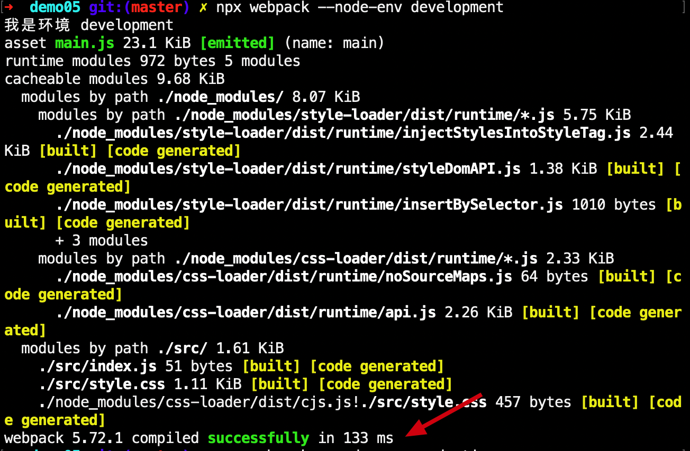
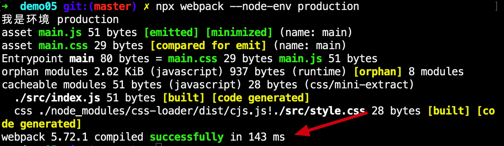

## 使用 mini-css-extract-plugin

[webpack 官网](https://webpack.js.org/plugins/mini-css-extract-plugin/)介绍这款插件,目的是当网页加载的时候 js 文件下载过久，将 js 文件中的 css 文件抽离出去。  
现在有两个文件，一个是 js 文件，一个是 css 文件  
当 js 文件引入了 css 文件的时候，webpack 打包的时候默认是会把 js 和 css 混合打包的，这时候就造成了打包的 js 文件过大，导致下载速度过慢，`mini-css-extract-plugin`会把 js 文件中的 css 抽离出去，打包成两个文件————js/css 文件。  
另外官方还建议在`webpack`使用该插件的时候在开发环境下使用`style-loader`而不是该插件，因为抽离 css 打包的时候需要时间，`style-loader`打包的时候会更快，在## 生产环境 ##的时候，使用该插件更优。

### dev 环境下的打包时间

### pro 环境下的打包时间

